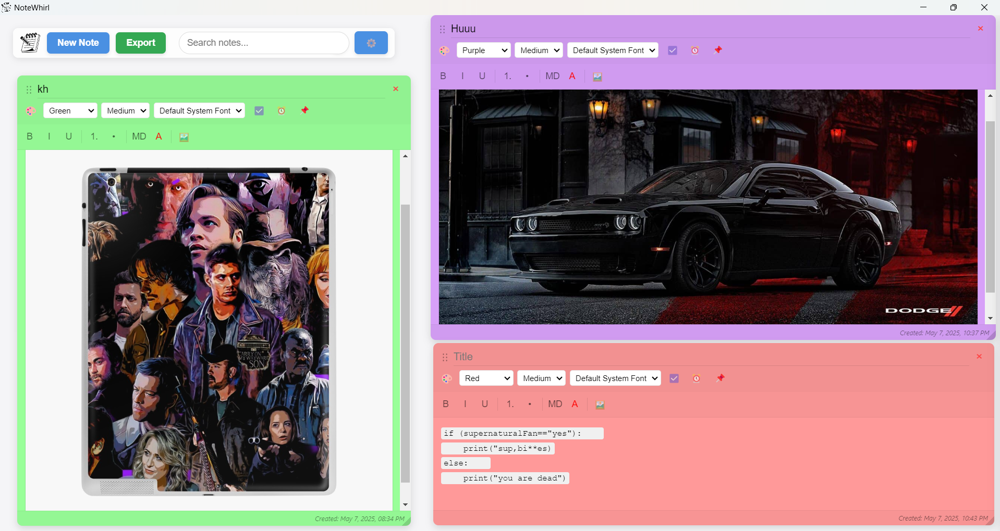

# NoteWhirl

A minimalistic, fast, and reliable desktop sticky notes application built with Electron and SQLite.



## Features

- 📝 Create, edit, and organize sticky notes on your desktop
- ✏️ Add titles to your notes for better organization
- 🎨 Customizable note colors with random color option for new notes
- 🔤 Multiple font sizes and font families to choose from
- 🌓 Light and dark theme support
- 📊 Rich text formatting with bold, italic, lists, and more
- 📷 Image attachments (max 5MB per image)
- ✅ Interactive checklists for task management
- ⏰ Reminders with desktop notifications
- 📤 Export notes to text files
- 📌 Pin important notes to stay on top
- 🔍 Powerful search functionality that works with both rich text and plain text notes
- 🔄 System tray icon for easy access when minimized

## Installation

### Download Pre-built Binaries

Download the latest release for your platform from the [Releases](https://github.com/YourUsername/NoteWhirl/releases) page.

### Build from Source

1. Clone the repository:
   ```
   git clone https://github.com/YourUsername/NoteWhirl.git
   cd NoteWhirl
   ```

2. Install dependencies:
   ```
   npm install
   ```

3. Start the application in development mode:
   ```
   npm start
   ```

4. Build distributable packages:
   ```
   npm run build
   ```
   This will create distributable packages in the `dist` folder.

## Usage

- **Creating Notes**: Click the "New Note" button or press Ctrl+N
- **Adding Titles**: Each note has a title field at the top
- **Editing**: Click on a note to start editing
- **Formatting**: Use the formatting toolbar to style your text
- **Moving**: Drag notes by their header
- **Resizing**: Drag the bottom-right corner to resize
- **Changing Colors**: Select from preset colors using the color dropdown
- **Font Options**: Change font size and family using the dropdowns
- **Deleting**: Click the X button or select a note and press Delete
- **Search**: Use the search box to filter your notes by title or content
- **Settings**: Click the gear icon to access settings
- **System Tray**: The app minimizes to system tray; click the icon to restore
- **Pin Notes**: Click the pin icon to keep important notes on top
- **Export**: Press Ctrl+E or click the Export button

## Keyboard Shortcuts

- **Ctrl+N**: Create a new note
- **Delete**: Delete the selected note
- **Ctrl+F**: Focus the search bar
- **Ctrl+S**: Open settings panel
- **Ctrl+H**: Show/hide the help dialog
- **Ctrl+E**: Export all notes
- **Escape**: Clear search or close dialogs

## Development

### Project Structure

- `main.js` - Main Electron process
- `index.html` - Application UI
- `styles.css` - Styling
- `notifications.js` - Notification system

### Technologies

- Electron
- SQLite (via better-sqlite3)
- HTML/CSS/JavaScript

## License

MIT

## Contributing

Contributions are welcome! Please feel free to submit a Pull Request. 